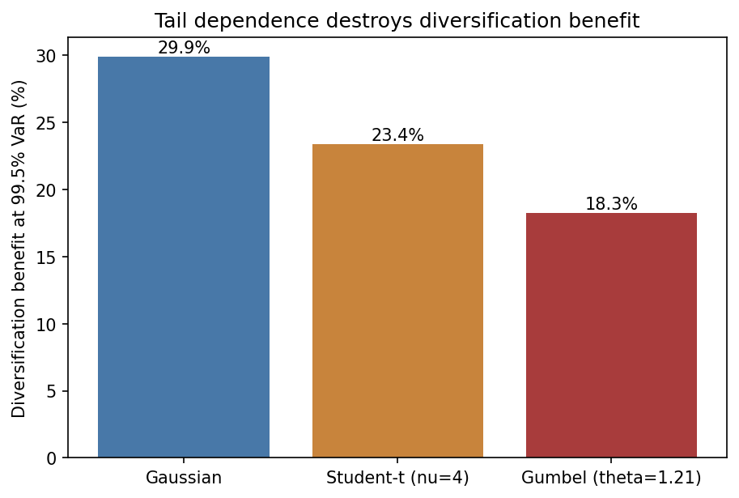
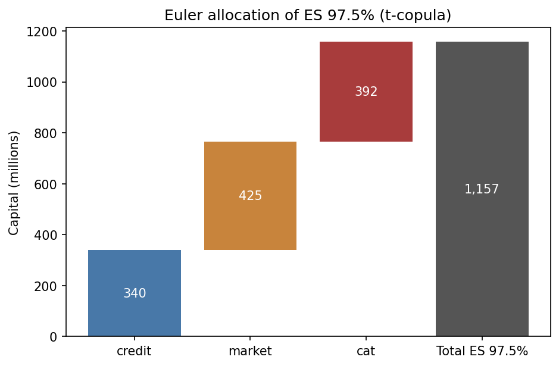
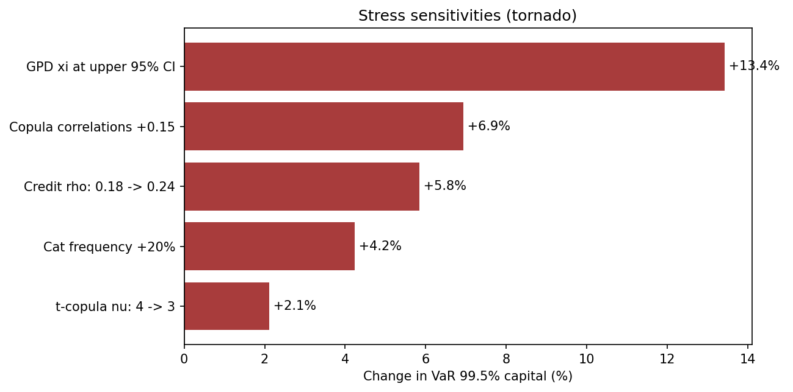

# Economic Capital Aggregation Engine — Model Documentation

Structured as an internal model documentation report. Headline numbers are
reproduced in [`results.md`](results.md), regenerated by `python run_all.py`.

## 1. Purpose and scope

The model measures the one-year economic capital requirement of a
hypothetical diversified financial institution with three risk books, all
expressed in USD millions:

| Risk | Book | Size |
|---|---|---|
| Credit | Corporate loan portfolio, 750 obligors | EAD 15,000 |
| Market | Fixed-weight ETF portfolio (50% SPY / 40% TLT / 10% GLD) | MV 2,000 |
| Catastrophe | 2% participation share of industry storm/flood losses | — |

Outputs: VaR 99.9% (Basel one-year), VaR 99.5% (Solvency II SCR),
ES 97.5% (FRTB), Euler capital allocation by risk type, and a one-at-a-time
stress layer. Intended audience: capital management and model validation.
The model is a demonstration vehicle; see `LIMITATIONS.md`.

## 2. Data

- **Market:** daily adjusted closes for SPY, TLT, GLD from Yahoo Finance,
  2006-present (~19 years, includes 2008 and 2020). Cached at
  `data/raw/market_prices.csv`.
- **Catastrophe:** an event catalog at `data/processed/cat_catalog.csv`,
  built by `scripts/build_cat_catalog.py`. With an EM-DAT export
  (`data/raw/emdat.xlsx`, free academic registration at emdat.be) it uses
  inflation-adjusted storm/flood damage above $100m. Without one, it
  generates a **synthetic** 45-year pseudo-catalog calibrated to the order
  of magnitude of published industry figures; the `source` column flags
  which was used and `results.md` reports it.
- **Credit:** fully synthetic portfolio; PDs loosely calibrated to long-run
  rating-agency annual default tables (AA 0.02% … B 5%).

## 3. Methodology

### 3.1 Credit — Vasicek one-factor model (`src/credit.py`)

Obligor i's normalized asset value is driven by one systematic factor Z:

    A_i = sqrt(rho) Z + sqrt(1 - rho) eps_i,   Z, eps_i ~ iid N(0,1)

with default iff `A_i < Phi^{-1}(PD_i)` and scenario loss
`L = sum_i 1{default_i} EAD_i LGD_i`. This is the model underlying the Basel
IRB formula. rho = 0.18, inside the Basel IRB corporate range (0.12-0.24).

### 3.2 Market — GARCH(1,1) filtered historical simulation (`src/market.py`)

Daily portfolio log returns r_t (percent) follow

    r_t = mu + eps_t,  eps_t = sigma_t z_t,  z_t ~ t_nu
    sigma_t^2 = omega + alpha eps_{t-1}^2 + beta sigma_{t-1}^2

fitted by ML (`arch`). Historical residuals are devolatilized to
`z_t = eps_t / sigma_t`, then **250-day paths** are simulated by
bootstrapping z and propagating the GARCH recursion from the current
conditional variance. The annual loss is the compounded path P&L. This
avoids square-root-of-time scaling and preserves volatility clustering at
the one-year horizon (the iid bootstrap still loses serial dependence beyond
GARCH — noted in limitations).

### 3.3 Catastrophe — compound Poisson with GPD tail (`src/catastrophe.py`)

Annual loss `S = sum_{j=1}^{N} X_j` with:

- **Frequency** N ~ Poisson(lambda) fitted to annual event counts; if the
  dispersion ratio (variance/mean) exceeds 1.5 the model switches to a
  method-of-moments negative binomial (overdispersion check).
- **Severity** X semiparametric: empirical resampling below threshold u,
  GPD above it (Peaks Over Threshold):

      P(X - u > y | X > u) = (1 + xi y / beta)^(-1/xi)

  u is set at the 90th percentile of event losses, supported by the mean
  excess plot (`figures/cat_evt_diagnostics.png`): e(u) is approximately
  linear beyond that point and ~50 exceedances remain for a stable ML fit.
  The shape xi is reported with an asymptotic 95% CI; xi > 0 indicates a
  heavy tail and xi >= 1 an infinite mean (flagged if it occurs, and the
  upper-CI value is a stress in section 7).

### 3.4 Aggregation — copulas (`src/aggregation.py`)

Marginal simulations (200k scenarios each) are mapped to uniforms by their
empirical CDFs (PIT) and joined under three copulas, then mapped back via
inverse empirical CDFs and summed (500k joint scenarios):

- **Gaussian** (from scratch, Cholesky): zero tail dependence.
- **Student-t, nu=4** (from scratch, Gaussian over chi-square): symmetric
  tail dependence — the **reported base model**.
- **Gumbel** (from scratch, Marshall-Olkin / positive-stable frailty):
  upper tail dependence lambda_U = 2 - 2^{1/theta}, appropriate for joint
  extreme losses.

**Dependence calibration is an explicit assumption**, not an estimate:
annual losses across risk types provide no usable joint sample. The base
correlation matrix is credit-market 0.50 (both recession-driven),
credit-cat 0.10, market-cat 0.20 (post-event financial spillover). Gumbel's
theta is set by matching the average pairwise Kendall tau of the Gaussian
matrix (tau = 1 - 1/theta), so the three copulas embody the *same overall
dependence level* and differ only in tail behaviour. The stress layer
quantifies the cost of this assumption being wrong.

### 3.5 Capital metrics (`src/capital.py`)

VaR_alpha is the empirical alpha-quantile of total loss; ES_alpha the mean
loss beyond it. Monte Carlo standard errors use batch means (50 batches).
**Euler allocation** under ES:

    EC_k = E[ L_k | L_total > VaR_alpha(L_total) ]

which sums to total ES by construction (full allocation, verified in tests).

## 4. Calibration summary

| Parameter | Value | Justification |
|---|---|---|
| Credit rho | 0.18 | Mid Basel IRB corporate range |
| PD by rating | 0.02%-5% | Rating-agency long-run default tables |
| LGD | U(0.40, 0.60) | Senior unsecured ballpark |
| GARCH spec | (1,1), t innovations | Standard; passes backtest |
| GPD threshold | 90th pct of events | Mean excess plot, >=50 exceedances |
| Copula corr | 0.5 / 0.1 / 0.2 | Economic judgment (see 3.4), stressed |
| t-copula nu | 4 | Strong tail dependence; stressed to 3 |
| Gumbel theta | tau-matched to corr | Like-for-like comparison |
| Cat share | 2% of industry loss | Sets book comparable to credit/market |
| Scenarios | 200k marginal / 500k joint | MC convergence plot, s.e. < 1% of VaR |

## 5. Validation

| Check | Where | Result (see results.md) |
|---|---|---|
| Credit vs Vasicek LHP analytical CDF | `figures/credit_vasicek_validation.png` | CDFs overlay; residual gap reflects finite granularity + heterogeneity |
| Market 99% 1-day VaR out-of-sample backtest | `figures/market_var_backtest.png` | Kupiec POF p-value reported; exception count vs 1% expected |
| GPD QQ plot + xi CI | `figures/cat_evt_diagnostics.png` | Points on diagonal; xi CI reported |
| Copula uniformity (KS), independence and convergence limits | `tests/test_aggregation.py` | Pass |
| Euler full-allocation | `tests/test_capital.py` | Exact |
| MC convergence of VaR 99.5% | `figures/mc_convergence.png` | Stable from ~200k scenarios |

The unit test suite (28 tests) covers model invariants: stationarity,
loss bounds, independent-default limit, compound-mean identity, ES >= VaR,
reproducibility under fixed seeds. Run with `pytest`.

## 6. Results

See [`results.md`](results.md) (regenerated on every run) for: standalone
VaRs, the copula comparison table, capital metrics with MC standard errors,
the Euler allocation, and stress results. Headline charts:

## 7. Stress and sensitivity layer

One-at-a-time re-runs under fixed seeds, reported as % change in VaR 99.5%:
copula correlations +0.15; t-copula nu 4→3; GPD xi at the upper end of its
95% CI; cat frequency +20% (climate-trend narrative); credit rho 0.18→0.24.
The dominant sensitivities are the GPD shape and the dependence assumptions —
exactly the parameters least identified by data, which is the central model
risk message.

## 8. Limitations and model risk

See [`LIMITATIONS.md`](../LIMITATIONS.md) — data coarseness, synthetic
portfolios, exchangeable Gumbel, empirical-tail truncation, missing risk
types, and the dependence-calibration problem.
